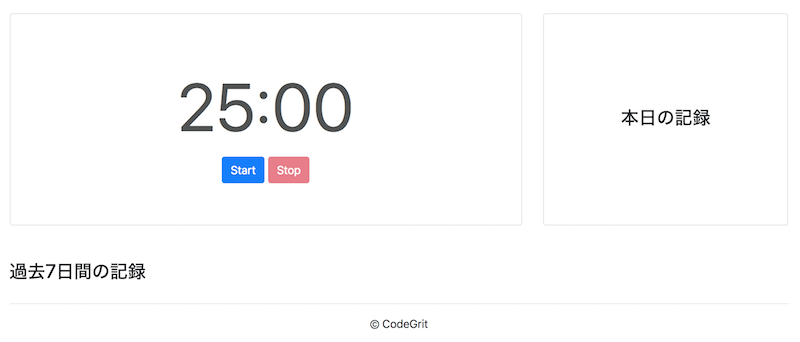
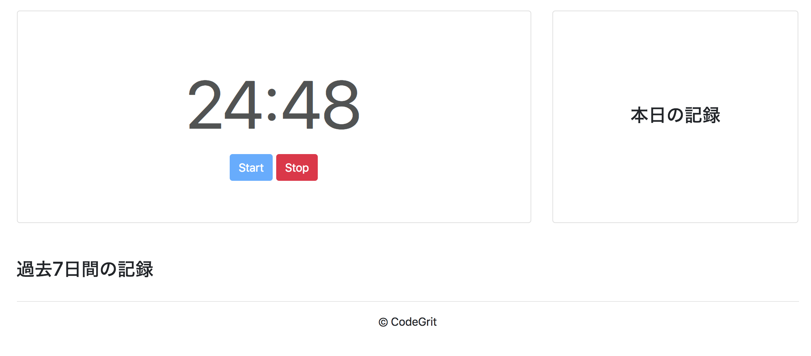

# Lesson 11. アプリケーションを作る

## 目的

- 小規模なアプリ開発の流れを知る。

## ポモドーロタイマーアプリを作ろう

ポモドーロとは、イタリア語でトマトという意味です。よくトマトの形をしたキッチンタイマーがありますが、ここからヒントを得て、タイマーを使って、25分間作業をしたら、5分間休憩する。ということを繰り返して作業効率を上げるポモドーロ・テクニックというタスク管理手法が生まれました。今回作るポモドーロタイマーはこのテクニックを利用するためのアプリです。

## ポモドーロタイマーにおける用語集

1. 作業インターバル
作業時間25分間の区切り

2. ショートブレーク
5分間の短時間休憩

3. ロングブレーク
15分間の長時間休憩

4. インターバル
作業インターバルと休憩時間とを合わせた１区切りの時間)

5. 目標インターバル数
目標とする1日の作業インターバル数。
仕事だと1日10回が一般的、今回のアプリでは4回を目標にします。

## ポモドーロタイマーの仕様

今回は、機能を最小限に抑えたポモドーロタイマーアプリを作っていきます。

1. スタートボタンを押すと25分間の作業インターバルが始まる。
2. 25分間のカウントダウンが終わると、5分間のショートブレークが開始する。
3. 5分間の休憩時間が終わると、再度25分間の作業インターバルが始まる。
4. 長期インターバルはなし。
5. インターバルの記録が最大でその日の開始時刻から過去1週間分LocalStorageに保存される。
6. 1週間を超えた履歴は削除していく。
7. ページ上には、インターバルやブレークのカウントダウン、過去の履歴を表示
8. 一時停止や、作業時間、休憩時間の変更などの機能は入れない。
9. 停止ボタンを押すとインターバルがリセットされる。回数はリセットされない。

## 完成イメージ


## スターターファイル

- [codegrit-jp-students/js-unit02-lesson11-starter](https://github.com/codegrit-jp-students/js-unit02-lesson11-starter)

上記のURL先のリポジトリをフォークして、レッスンコードを書き進めて行きましょう。

## アプリ作成の流れ

1. STEP1: Appクラスを作成して、サイトを開いたときにインスタンスが作られるようにする。
2. STEP2: 初期状態のカウントダウンタイマーの表示(25:00)を行う。
3. STEP3: タイマーをスタートするためのstartTimerファンクションを作成する。
4. STEP4: カウントダウン中に表示をアップデートするためのupdateTimerファンクションを作成する。
5. STEP5: カウントダウンをストップするためのstopTImer関数を作成する。
6. STEP6: 本日の作業回数を表示する。
7. STEP7: 過去7日間の作業回数を表示する。
8. STEP8: アプリ立ち上げ時に7日以上前のデータを削除する。

この流れに沿ってアプリを実装していきましょう。

## npmスクリプト

1. `npm run dev-server` - webpack-dev-serverを立ち上げます。ブラウザでlocalhost:8080上を開くとアプリを確認出来ます。
2. `npm run test` - jestを実行します。

## STEP1: Appクラスを作成しよう

### 1-1: ロード時にAppクラスのインスタンスを作成する。

まずは、srcフォルダ内のindex.jsファイルを開いて、Appクラスを作成します。またindex.html内で、bundle.jsが読み込まれたときにAppクラスのインスタンスが作成されるようにします。

index.js

```javascript
import './assets/scss/styles.scss';

class App {
  constructor() {}
}

// ロード時にAppクラスをインスタンス化する。
window.addEventListener('load', () => new App()); 
```

### 1-2: 初期パラメータを設定する。

このインスタンス化された際の初期のパラメーターを設定していきます。まずは、タイマーの状態を表すために以下の項目の初期値を設定しましょう。

- 作業時間と休憩時間の長さ(workLengthとbreackLength)
- タイマーが動いているかどうかの状態(isTimerStopped)
- 作業中か休憩中かの状態(onWork)

```javascript
...省略
class App {
  constructor() {
    this.workLength = 25; // 25分間
    this.breakLength = 5; // 5分間
    this.isTimerStopped = true; // 最初はタイマーは止まっている
    this.onWork = true; // 最初は作業からタイマーは始まる
  }
}
...省略
```

## STEP2: 初期状態のタイマーの表示を行う

### 2-1: カウントダウンを表示する要素を取得する

さて、Appクラスの初期パラメータが設定出来たので、タイマーの初期値がサイト上でも表示されるようにしていきましょう。

index.htmlを見ていただくと、`<div id="time-display" class="time-display"></div>`という部分が見つかるかと思います。タイマーの時間はこの要素の中に表示します。

この要素をまずは取得しましょう。

```javascript
...省略
class App {
  constructor() {
    ...省略
    this.timeDisplay = document.getElementById('time-display');
  }
}
...省略
```

### 2-2: カウントダウンの初期値表示のテストを書く

さて、次に初期値表示のためのテストを書いていきます。

まずはindex.jsに`export default App`を追加して、Appクラスをモジュール化します。

```javascript
...省略
class App {省略}

export default App;
```

testフォルダ内のindex.test.jsファイルにテストを書いていきましょう。カウントダウンの初期表示は"25:00"ですので、これをテストで表します。

index.test.js
```javascript
import App from '../src/index';
import template from './template'; // テスト内でhtmlファイルのbody部分を読み込む。

describe('displayTime', () => {
  test('初期化時に25:00を表示する。', () => {
    document.body.innerHTML = template;
    const app = new App();
    const timeDisplay = document.getElementById('time-display');
    expect(app.isTimerStopped).toBeTruthy(); // 初期状態でタイマーは止まっています
    expect(timeDisplay.innerHTML).toEqual('25:00'); // 25:00が表示されていることを確認します。
  });
});
```

上記では、templateファイルからHTMLのコードを読み込んで、bodyタグ内に読み込んだコードを適用しています。その後、読み込んだコードから`id="time-display"`となっている要素を読み込み、この要素無いに初期値である"25:00"が表示されるかどうかをテストしています。

テストコードを動かしてみましょう。まだ、コードを書いていないので以下のようにテスト失敗の結果が出ます。

```bash
$ npm run test
...
Tests:       1 failed, 1 total
```

### 2-3. displayTimeファンクションを実装する

さて、次にこのテストが通るようにdisplayTimeファンクションを書いていきます。

```javascript
...省略

class App {
  constructor() {
    ...省略

    this.displayTime(); // 初期化時にdisplayTimeを呼び出す。
  }

  displayTime() {
    // 残りの分数と秒数を与えるための変数
    let mins;
    let secs;
    // タイマーがストップしている時は、常に作業時間の長さを表示。
    if (this.isTimerStopped) {
      mins = this.workLength;
      secs = 0;
    }
    // 数値を文字に変換
    const minsString = mins.toString();
    let secsString = secs.toString();
    // 秒数が一桁のときは0を加えて2桁表示にする。
    if (secs < 10) {
      secsString = `0${secsString}`;
    }
    // 最後に分数と秒数を表示
    this.timeDisplay.innerHTML = `${minsString}:${secsString}`;
  }
}
```

現状は、タイマーが動き出した後の表示は実装しておらず、タイマーが止まっているときに"25:00"が表示されるようにのみしています。テスト結果を再度見てみましょう。無事にテストが通っていることが確認出来たでしょうか。

実際の画面も開いてみてみましょう。以下の画像のように"25:00"が表示されているはずです。



## STEP3: startTimerファンクションを実装する

さて、止まった状態の表示が出来たのでいよいよタイマーを動かしていきます。カウントダウンの表示の流れは以下のようになります。

1. ユーザーが「スタート」ボタンを押すとstartTimerファンクションが呼び出される。
2. 開始時の時間がstartAt、25分後の時間がendAtとしてインスタンスにセットされる。
3. setIntervalでupdateTimerファンクションを定期的に呼び出し、終了時間(endAt)とチェック時の時刻の差を残り時間として、表示する。

### 3-1. 変数とファンクションの定義

この3つを満たすように、まずはstartAtとendAtの2つのインスタンス変数、そしてstartTimerとupdateTImerの2つのファンクションを定義します。また、それと同時に後ほど使うスタートボタンとストップボタンの2つの要素も取得しておきます。

```javascript
class App {
  constructor() {
    ...省略
    this.startAt = null; // カウントダウン開始時の時間
    this.endAt = null; // カウントダウン終了時の時間

    this.timeDisplay = document.getElementById('time-display');
    this.startButton = document.getElementById('start-button'); // スタートボタン
    this.stopButton = document.getElementById('stop-button'); // ストップボタン

    this.displayTime();
  }

  startTimer() {}
  updateTimer() {}
  ...省略
}
```

### 3-2. スタートボタンとstartTimerファンクションを連動させる

さて、次にスタートボタンを押したときにstartTimerが呼び出されるようにaddEventListnerを設定します。

ここで、constructor内で設定してもいいのですがスタートボタン以外にも、ストップボタンにも設定する必要が後々出てきますので、toggleEventsというファンクションを作成して、ここでまとめて設定するようにしましょう。

```javascript
class App {
  constructor() {
    ...省略

    this.startTimer = this.startTimer.bind(this); 

    this.timeDisplay = document.getElementById('time-display');
    this.startButton = document.getElementById('start-button'); // スタートボタン
    this.stopButton = document.getElementById('stop-button'); // ストップボタン

    this.toggleEvents();
    this.displayTime();
  }
  
  toggleEvents() {
    this.startButton.addEventListener('click', this.startTimer);
  }

  startTimer(e = null) {
    if (e) e.preventDefault();
  }
  updateTimer() {}
```

併せて、現在constructor内に書いている、要素の取得も別のgetElementsというファンクションにまとめてしまいましょう。

```javascript
class App {
  constructor() {
    ...省略

    // 以下の3つを別ファンクションに移す。
    // this.timeDisplay = document.getElementById('time-display');
    // this.startButton = document.getElementById('start-button'); // スタートボタン
    // this.stopButton = document.getElementById('stop-button'); // ストップボタン

    this.getElements();
    this.toggleEvents();
    this.displayTime();
  }

  getElements() {
    this.timeDisplay = document.getElementById('time-display');
    this.startButton = document.getElementById('start-button');
    this.stopButton = document.getElementById('stop-button');
  }

  ...省略
  
}
```

これでconstructor内がすっきりとしました。

### 3-3. startTimerファンクションでのボタンの属性変更をテストする。

さて、では次にstartTimerファンクションのテストを書いていきましょう。startTimerを押したときには、startAtとendAtが設定される他に、スタートボタンにdisable属性が追加されてクリックできないようになります。逆にストップボタンからはdisable属性が外されてクリック可能となります。また、isTimerStoppedも、trueからfalseへと変更されなければなりません。この3つをテストに盛り込みます。

```javascript
describe('startTimer', () => {
  test('スタートボタンにdisable属性を追加', () => {
    document.body.innerHTML = template;
    const app = new App();
    app.startTimer();
    const startButton = document.getElementById('start-button');
    const stopButton = document.getElementById('stop-button');
    expect(startButton.disabled).toEqual(true);
    expect(stopButton.disabled).toEqual(false);
    expect(app.isTimerStopped).toEqual(false);
  });
});
```

さて、テスト結果を再度見るとテスト失敗しているはずです。テストが通るようにstartTimerファンクションに以下を追加します。

```javascript
startTimer(e = null) {
  if (e) e.preventDefault();
  this.startButton.disabled = true;
  this.stopButton.disabled = false;
  this.isTimerStopped = false;
}
```

再度テスト結果を確認してみましょう。無事テストが通っているはずです。

### 3-4. startTimerファンクションでのstartAtとendAtの割当をテストする

さて、次にテストすべきはstartAtとendAtに適切な時間が入っているかです。JavaScritp組み込みのクラスを使って時間を扱ってもいいのですが、今回はJavaScriptプログラマ間でよく使われている時間操作のためのライブラリmoment.jsを使っていきます。

以下は、今回のレッスンで使用するmoment.jsの関数のリストです。

```javascript
let momentItem = moment(); // 現在の時刻でmomentインスタンスを作成する。 
momentItem.format('MM月DD日') // 様々なフォーマットで時間を表示する。
momentItem.add(25, 'minutes'); // momentインスタンスの時間に25分を加える。
momentItem.subract(25, 'minutes'); // momentインスタンスの時間を25分戻す。
let cloneItem = moment(momentItem); // momentインスタンスを複製する。
momentItem.valueOf(); 
/* 時間をタイムスタンプ形式で取得する。2つの時間を比較するときに便利。 
例: 
momentItem.format(); => "2018-07-02T15:44:40+08:00"
momentItem.valueOf(); => 1530517480830
*/
momentItem.diff(cloneItem) // 2つのmomentインスタンスのタイムスタンプの差を返す。ここでは0が返る。
momentItem.startOf('day'); // 1日の始まりの時間を取得する。
```

さてstartTimerファンクションでは現在時刻をstartAtとして保存するのですが、刻々と変わっていく現在時刻をテストするのは大変です。そこでstartTimerファンクションの引数にtimeを設定します。またtimeに何も与えられない場合は現在時刻を初期値として入れます。

```javascript
startTimer(e = null, time = moment()) {
  if (e) e.preventDefault();
  this.startButton.disabled = true;
  this.stopButton.disabled = false;
  this.isTimerStopped = false;
}
```

ではテストを書いていきましょう。

```javascript
describe('startTimer', () => {
  ...省略
  test('startAtとendAtを適切に設定する。', () => {
    document.body.innerHTML = template;
    const app = new App();
    const now = moment(); // 現在時刻のmomentインスタンスを作成
    app.startTimer(null, now); 
    expect(app.startAt.valueOf()).toEqual(now.valueOf()); // startAtに現在時刻が与えられているかをテスト
    expect(app.endAt.valueOf()).toEqual(now.add(25, 'minutes').valueOf());
    // endAtがstartAtから25分後になっているかテスト
  });
});
```

これが通るようにファンクションを実装します。

```javascript
startTimer(e = null, time = moment()) {
  if (e) e.preventDefault();
  this.startButton.disabled = true;
  this.stopButton.disabled = false;
  this.isTimerStopped = false;
  this.startAt = time;
  const startAtClone = moment(this.startAt);
  this.endAt = startAtClone.add(this.workLength, 'minutes');
  this.timerUpdater = window.setInterval(this.updateTimer, 500);
  // タイムラグがあるので、0.5秒ごとにアップデートする。
}
```

上記のコードでは、startAtとendAtを設定した後に、timerUpdaterという変数に`window.setInterval(this.updateTimer, 500);`を格納して、500ミリ秒ごとにupdateTimerファンクションが呼び出されるようにしています。

## STEP4: updateTimerファンクションを実装する

さて、ここまででupdateTimerが定期的に呼び出されるようになりました。updateTimerの役割は以下の2つです。

1. タイマーの残り時間が0以下の場合、作業中のときは休憩時間に、休憩中のときは作業時間に状態を切り替える。(つまりonWorkの状態を変更する)
2. displayTimeを呼び出して、時間表示を更新する。

### 4-1: updateTimer内でdisplayTimeを呼び出す。

まずは2のみを実装していきましょう。ここでstartTimerと同様にupdateTimerとdisplayTimeの2つのファンクションがtimeという引数を取り、初期値に現在時刻が入るように変更しましょう。これでテストが自由な時間で出来るようになります。

```javascript
class App {
  constructor() {
    ...省略
    this.startTimer = this.startTimer.bind(this);
    this.updateTimer = this.updateTimer.bind(this);
    this.displayTime = this.displayTime.bind(this);
    ...省略
  }
  ...省略
  updateTimer(time = moment()) {
    this.displayTime(time);
  }

  displayTime(time = moment()) {
    // 残りの分数と秒数を与えるための変数
    let mins;
    let secs;
    // タイマーがストップしている時は、常に作業時間の長さを表示。
    if (this.isTimerStopped) {
      mins = this.workLength;
      secs = 0;
    }
    // 数値を文字に変換
    const minsString = mins.toString();
    let secsString = secs.toString();
    // 秒数が一桁のときは0を加えて2桁表示にする。
    if (secs < 10) {
      secsString = `0${secsString}`;
    }
    // 最後に分数と秒数を表示
    this.timeDisplay.innerHTML = `${minsString}:${secsString}`;
  }
}
```

### 4-2: displayTimeをアップデートしてカウントダウンの表示を行う

さて、displayTime関数なのですが、現状は初期状態の表示しか実装しておらず、カウントダウンに合わせた表示が出来ません。そこで、カウントダウン中の表示がうまく行われるようにテストを書いていきます。

```javascript
describe('displayTime', () => {
  ...省略
  test('カウントダウン中の時間を適切に表示する。', () => {
    document.body.innerHTML = template;
    const app = new App();
    const now = moment();
    const startOfToday = now.startOf('day');
    // タイマースタート後の状態を作り出す。
    app.startButton.disabled = true;
    app.stopButton.disabled = false;
    app.isTimerStopped = false;
    app.startAt = startOfToday;
    app.endAt = moment(startOfToday).add(25, 'minutes');
    // タイマースタートしてから51秒後の時間でテストを行う。
    app.displayTime(moment(startOfToday).add(51, 'seconds'));
    const timeDisplay = document.getElementById('time-display');
    expect(timeDisplay.innerHTML).toEqual('24:09'); // 51秒経過しているので残り時間は24:09
  });
});
```

再度、テスト結果を見てみましょう。`TypeError: Cannot read property 'toString' of undefined`というエラーが表示されているかと思います。これは、タイマーが動いている時にdisplayTime内のminsとsecsの2つの変数がundefinedのままのため生じています。

displayTimeをアップデートして、エラーの解決をしテストが通るようにしましょう。

```javascript
...省略

const SECOND = 1000; // 1000ミリ秒
const MINUTE = 60 * SECOND; // 1分のミリ秒数
const DAY = 24 * 60 * MINUTE; // 1日のミリ秒数

class App {
  ...省略
  displayTime(time = moment()) {
    let mins;
    let secs;
    if (this.isTimerStopped) {
      mins = this.workLength.toString();
      secs = 0;
    } else {
      const diff = this.endAt.diff(time); // 与えられた時間(通常現在時刻)と、終了時刻との差を取得。差はミリ秒で得られる。
      mins = Math.floor(diff / MINUTE); // 分数を得て、少数点以下の切り捨てを行う
      secs = Math.floor((diff % MINUTE) / 1000); // 秒数を得て、少数点以下の切り捨てを行う
    }
    const minsString = mins.toString();
    let secsString = secs.toString();
    if (secs < 10) {
      secsString = `0${secsString}`;
    }
    this.timeDisplay.innerHTML = `${minsString}:${secsString}`;
  } 
}
```

上記のようにして、終了時刻と現在時刻との差をミリ秒単位で取得後、分と秒を取得しています。再度テストを確認してみましょう。無事にテストが通っているはずです。

実際の画面でも見てましょう。ちゃんと動いていることが確認出来るでしょうか? しかし、何度か試してみると、24:59と24:58との間が非常に短いことに気づくかと思います。これはなぜかというと最初のdisplayTimeの呼び出しが500ミリ秒経過した時点で、起こっているため、24:59と24:58との間が500ミリ秒以下しかないためです。そこでstartTimerファンクション実行時にdisplayTimeが呼び出されるようにします。

```javascript
startTimer(e = null, time = moment()) {
    ...省略
    this.displayTime();
  }
```

再度、確認することで違和感なくタイマーが動くようになったはずです。



### 4-3: カウントダウンが0秒になったときの切り替えを実装する

さて次に、作業時間が0秒になった時と休憩時間が0秒になったときの切り替えを実装します。まずはテストを書きましょう。

```javascript
describe('updateTimer', () => {
  test('作業時間が終わったら休憩時間に切り替える。', () => {
    document.body.innerHTML = template;
    const app = new App();
    const now = moment();
    const startOfToday = now.startOf('day');
    // 作業中の状態を作り出す。
    app.startButton.disabled = true;
    app.stopButton.disabled = false;
    app.isTimerStopped = false;
    app.startAt = startOfToday;
    app.endAt = moment(startOfToday).add(25, 'minutes');
    // 終了時刻から100ミリ秒後の時間でテストを行う。
    app.updateTimer(moment(startOfToday).add(25, 'minutes').add(100, 'millisecond'));
    const timeDisplay = document.getElementById('time-display');
    expect(timeDisplay.innerHTML).toEqual('5:00');
    expect(app.onWork).not.toBeTruthy(); // 休憩時間に切り替わっている。
  });
  test('休憩時間が終わったら作業時間に切り替える。', () => {
    document.body.innerHTML = template;
    const app = new App();
    const now = moment();
    const startOfToday = now.startOf('day');
    // 休憩中の状態を作り出す。
    app.onWork = false;
    app.startButton.disabled = true;
    app.stopButton.disabled = false;
    app.isTimerStopped = false;
    app.startAt = startOfToday;
    app.endAt = moment(startOfToday).add(5, 'minutes');
    // 終了時刻から100ミリ秒後の時間でテストを行う。
    app.updateTimer(moment(startOfToday).add(5, 'minutes').add(100, 'millisecond'));
    const timeDisplay = document.getElementById('time-display');
    expect(timeDisplay.innerHTML).toEqual('25:00'); 
    expect(app.onWork).toBeTruthy(); // 作用時間に切り替わっている。
  });
});
```

テストが通らないことを確認したら、このテストが通るようにupdateTimerを実装していきます。

```javascript
updateTimer(time = moment()) {
  const rest = this.endAt.diff(time); // 残り時間を取得
  if (rest <= 0) { // 残り時間が0以下の場合に切り替えを行う。
    this.onWork = !this.onWork;
    this.startAt = time;
    this.endAt = this.onWork ? moment(time).add(this.workLength, 'minutes')
      : moment(time).add(this.breakLength, 'minutes');
  }
  this.displayTime(time);
}
```

これで、無事にテストが通ることが確認出来たはずです。

## STEP5: stopTimerを実装する。

### 5-1: stopTimerのテストとファンクションを書く

さて、次にstopTimerの実装ですが、これは単にスタート前の状態にタイマーをリセットするだけですので簡単です。まずはテストを書きましょう。

```javascript
describe('stopTimer', () => {
  test('it should reset the timer', () => {
    document.body.innerHTML = template;
    const app = new App();
    const now = moment();
    const startOfToday = now.startOf('day');
    app.startButton.disabled = true;
    app.stopButton.disabled = false;
    app.isTimerStopped = false;
    app.startAt = startOfToday;
    app.endAt = moment(now).add(20, 'minutes');
    app.stopTimer();
    const timeDisplay = document.getElementById('time-display');
    expect(timeDisplay.innerHTML).toEqual('25:00');
    expect(app.onWork).toBeTruthy();
    expect(app.isTimerStopped).toBeTruthy();
    expect(app.startButton.disabled).not.toBeTruthy();
  });
});
```

次に、stopTimerファンクションを実装していきます。

```javascript
class App {
  constructor() {
    ...省略
    this.stopTimer = this.stopTimer.bind(this);
    ...省略
  }
  toggleEvents() {
    this.startButton.addEventListener('click', this.startTimer);
    this.stopButton.addEventListener('click', this.stopTimer); // ストップボタンに対するクリックイベントでstopTimerファンクションを呼び出す。
  }
  stopTimer(e = null) {
    if (e) e.preventDefault();
    this.startAt = null;
    this.endAt = null;
    this.onWork = true;
    this.isTimerStopped = true;
    this.startButton.disabled = false;
    this.stopButton.disabled = true;
    window.clearInterval(this.timerUpdater);
    this.timerUpdater = null;
    this.displayTime();
  }
}
```

無事にテストが通ったでしょうか? 実際の画面でテストすろとタイマーの開始と終了がどちらも出来るようになったことが分かるはずです。

### 5-2: resetValuesファンクションを作成する。

さて、ここで分かる通りstopTimerはclearIntervalを除けば、初期状態に値をリセットしているだけなので、これをresetValuesというファンクションにまとめるとより、値をリセットしていることがクリアになるはずです。これを実装していきましょう。

```javascript
...
class App {
  constructor() {
    this.startTimer = this.startTimer.bind(this);
    this.updateTimer = this.updateTimer.bind(this);
    this.stopTimer = this.stopTimer.bind(this);
    this.resetValues = this.resetValues.bind(this);
    this.displayTime = this.displayTime.bind(this);

    this.resetValues();
    this.getElements();
    this.toggleEvents();
    this.displayTime();
  }
  resetValues() {
    this.workLength = 25;
    this.breakLength = 5;
    this.startAt = null;
    this.endAt = null;
    this.isTimerStopped = true;
    this.onWork = true;
  }
  ...
  stopTimer(e = null) {
    if (e) e.preventDefault();
    this.resetValues();
    this.startButton.disabled = false;
    this.stopButton.disabled = true;
    window.clearInterval(this.timerUpdater);
    this.timerUpdater = null;
    this.displayTime();
  }
  ...
```

これで全体が少しスッキリしました。

## STEP6: 本日の作業回数を表示する

さて、タイマーが出来たら後はそれほど難しくありません。まずは、本日の作業回数を表示していきましょう。これは以下のステップで行うことが出来ます。

1. getHistoryファンクションでlocalStorageから現在のデータ一覧を取得する
2. getHistoryで取得したデータ一覧に、新しい作業データを追加してlocalStorageに保存する。
3. getHistoryで取得したデータ一覧から本日の開始から現在までの作業終了回数を数えて表示する。

### 6-1. getHistoryファンクションで作業データを取得する。

localStorageにデータを保存していく前に、まずデータを取得出来るようにgetHistoryというファンクションを実装していきましょう。

まずはテストを書きます。

```javascript
describe('App.getHistory', () => {
  test('終了した作業インターバルの終了時間一覧を取得する。', () => {
    const startOfToday = moment().startOf('day');
    const val1 = moment(startOfToday).subtract(5, 'days').add(30, 'minutes').valueOf();
    const val2 = moment(startOfToday).subtract(5, 'days').add(60, 'minutes').valueOf();
    const collection = [val1, val2];
    // intervalDataというkey名でデータを保存します。
    localStorage.setItem('intervalData', JSON.stringify(collection)); 
    expect(App.getHistory()).toContain(val1);
    localStorage.clear();
  });
});
```

ここで一点注意したいのは、localStorageにはArrayを直接保存出来ないので、ArrayをJSON形式の文字列に変換する必要があることです。そのためJSON.stringify(collection)としてデータを変換しています。

このテストが通るようにgetHistoryファンクションを実装していきましょう。

```javascript
class App {
  constructor() {
    ...
    this.getHistory = App.getHistory.bind(this);
    ... 
  }
  static getHistory() {
    const items = localStorage.getItem('intervalData');
    let collection = [];
    // localStorageにはArrayを直接保存出来ないので、JSON形式で保存しています。
    // 取り出す時は、JSON.parseでarrayに戻します。
    if (items) collection = JSON.parse(items);
    return collection;
  }
}
```

ご覧の通り、localStorageからJSON形式のデータを取得して、それをJSON.parseでArrayに変換しています。

### 6-2. saveIntervalDataファンクションを実装する。

localStorageへのデータの保存にはsaveIntervalDataというファンクションを使います。まずはこのsaveIntervalDataのテストを書いていきましょう。

```javascript
describe('saveIntervalData', () => {
  test('it should save array of items', () => {
    document.body.innerHTML = template;
    const app = new App();
    const startOfToday = moment().startOf('day');
    // 作業終了時の時間のテストデータを作成
    const item = moment(startOfToday).subtract(5, 'days').add(60, 'minutes');
    app.saveIntervalData(item);
    expect(JSON.parse(localStorage.getItem('intervalData'))).toContain(item.valueOf());
    localStorage.clear();
  });
});
```

このテストが通るようにファンクションを実装していきます。

```javascript
class App {
  constructor() {
    ...
    this.saveIntervalData = this.saveIntervalData.bind(this);
  }
  ...省略
  saveIntervalData(momentItem) {
    const collection = this.getHistory(); // 既に保存されているデータの取得。
    collection.push(momentItem.valueOf()); // 新しいデータを追加する。
    // JSON形式で再度保存する。
    localStorage.setItem('intervalData', JSON.stringify(collection));
  }
}
```

### 6-3: 作業時間から休憩時間への切替りじにデータを保存する

さてsaveIntervalDataが出来たので、updateTimer内で作業から休憩へ切り替わるときにデータが保存されるようにしましょう。

まずはupdateTimerのテストをアップデートします。

```javascript
describe('updateTimer', () => {
  test('作業時間が終わったら休憩時間に切り替える。', () => {
    ...省略
    expect(app.getHistory()).toEqual([endAt.add(100, 'millisecond').valueOf()]); // データの保存を確認
  });
  ...
});
```

次にupdateTimerファンクション上でsaveIntervalを呼び出すようにします。

```javascript
updateTimer(time = moment()) {
  const rest = this.endAt.diff(time);
  if (rest <= 0) {
    if (this.onWork) {
      this.saveIntervalData(time); // 作業時からの切り替り時のみsaveIntervalを呼び出す。
    }
    this.onWork = !this.onWork;
    this.startAt = time;
    this.endAt = this.onWork ? moment(time).add(this.workLength, 'minutes')
      : moment(time).add(this.breakLength, 'minutes');
  }
  this.displayTime(time);
}
```

これで無事に作業時からの切り替えの際にデータが保存されるようになりました。準備が整ったので本日の作業回数を表示していきましょう。

### 6-4: 本日の作業回数を表示する

本日の作業回数は次の流れで取得出来ます。

1. 一度getHistoryでデータを取得
2. Arrayのfilterファンクションを利用して、本日のデータのみを得る。
3. 得たデータの長さを得る。

作業回数表示にはdisplayCyclesTodayというファンクションを利用します。まずはテストを書いていきます。

```javascript
describe('displayCyclesToday', () => {
  test('当日の完了した作業サイクル数を表示する。', () => {
    document.body.innerHTML = template;
    const app = new App();
    const startOfToday = moment().startOf('day');
    const time = moment(startOfToday).add(5, 'hours'); // 現在時刻を、午前5時に設定
    const val1 = moment(startOfToday).add(30, 'minutes').valueOf(); // 午前0:30に作業完了
    const val2 = moment(startOfToday).add(60, 'minutes').valueOf(); // 午前1:00に作業完了
    const collection = [val1, val2];
    localStorage.setItem('intervalData', JSON.stringify(collection));
    app.displayCyclesToday(time);
    const countToday = document.getElementById('count-today');
    const percentToday = document.getElementById('percent-today');
    expect(countToday.innerHTML).toEqual('2回 / 4回');
    expect(percentToday.innerHTML).toEqual('目標を50％達成中です。');
    localStorage.clear();
  });
});
```

次に、このテストが通るようにファンクションを実装しましょう。

```javascript
class App {
  constructor() {
    ...
    this.displayCyclesToday = this.displayCyclesToday.bind(this);
    ...
    this.resetValues();
    this.getElements();
    this.toggleEvents();
    this.displayTime();
    this.displayCyclesToday();
  }
  ...
  getElements() {
    this.timeDisplay = document.getElementById('time-display');
    this.countOfTodayDisplay = document.getElementById('count-today'); // 回数の表示
    this.percentOfTodayDisplay = document.getElementById('percent-today'); // ％の表示
    this.startButton = document.getElementById('start-button');
    this.stopButton = document.getElementById('stop-button');
  }
  ...
  displayCyclesToday(time = moment()) {
    const collection = this.getHistory();
    const startOfToday = time.startOf('day');
    // 今日の始まりより後の時間のデータのみを取得してfilterItemsに格納する。
    const filterItems = collection.filter(item => (
      parseInt(item, 10) >= startOfToday.valueOf()
    ));
    const count = filterItems.length;
    const percent = count / 4 * 100;
    this.countOfTodayDisplay.innerHTML = `${count.toString()}回 / 4回`;
    this.percentOfTodayDisplay.innerHTML = `目標を${percent}％達成中です。`;
  }
}
```

上記で述べた流れの通り、全データ取得後、フィルターをかけて本日のデータのみを取得後、長さを取得しています。これでテストが問題なく通るはずです。

## STEP7: 7日分のデータを表示する

さて、上とほぼ同じ流れで過去７日分のデータも取得出来ます。この場合は、for文を利用して今日の開始時の7日前から今日の開始時までの回数を1日ずつ取得します。データの取得と表示にはdisplayHistoryというファンクションを利用します。

まずはテストを書きましょう。

```javascript
describe('displayHistory', () => {
  test('it should show the numbrer of finished work sessions up to 7 days ago', () => {
    document.body.innerHTML = template;
    const startOfToday = moment().startOf('day');
    const SevenDaysAgo = moment(startOfToday).subtract(7, 'days');
    const val1 = moment(SevenDaysAgo).add(50, 'minutes').valueOf();
    const val2 = moment(SevenDaysAgo).add(80, 'minutes').valueOf();
    const val3 = moment(SevenDaysAgo).add(2, 'days').add('3', 'hours').valueOf();
    const val4 = moment(SevenDaysAgo)
      .add(3, 'days')
      .add('2', 'hours')
      .valueOf();
    const collection = [val1, val2, val3, val4];
    localStorage.setItem('intervalData', JSON.stringify(collection));
    const app = new App();
    const sevenDaysAgoTh = document.getElementsByTagName('th')[0];
    const fiveDaysAgoTh = document.getElementsByTagName('th')[2];
    const sevenDaysAgoTd = document.getElementsByTagName('td')[0];
    const fiveDaysAgoTd = document.getElementsByTagName('td')[2];
    expect(sevenDaysAgoTh.innerHTML).toEqual(SevenDaysAgo.format('MM月DD日'));
    expect(fiveDaysAgoTh.innerHTML).toEqual(SevenDaysAgo.add(2, 'days').format('MM月DD日'));
    expect(sevenDaysAgoTd.innerHTML).toEqual('2回<br>達成率50%');
    expect(fiveDaysAgoTd.innerHTML).toEqual('1回<br>達成率25%');
    expect(app.getHistory().length).toEqual(4);
  });
});
```

データの数が多いですが、先ほどの`displayCyclesToday`とほぼ同じ内容のテストです。このテストが通るようにファンクションを定義します。

```javascript
class App {
  constructor() {
    ...
    this.displayHistory = this.displayHistory.bind(this);
    ...
    this.displayCyclesToday();
    this.displayHistory();
  }
  ...
  getElements() {
    this.timeDisplay = document.getElementById('time-display');
    this.countOfTodayDisplay = document.getElementById('count-today');
    this.percentOfTodayDisplay = document.getElementById('percent-today');
    this.historyDisplay = document.getElementById('history');
    this.startButton = document.getElementById('start-button');
    this.stopButton = document.getElementById('stop-button');
  }
  ...
  displayHistory(time = moment()) {
    const collection = this.getHistory();
    const startOfToday = time.startOf('day');
    const startOfTodayClone = moment(startOfToday);
    const sevenDaysAgo = startOfTodayClone.subtract(7, 'days');
    const valOfSevenDaysAgo = sevenDaysAgo.valueOf();
    const tableEl = document.createElement('table');
    tableEl.classList.add('table', 'table-bordered');
    const trElDate = document.createElement('tr');
    const trElCount = document.createElement('tr');
    for (let i = 0; i <= 6; i += 1) {
      const filterItems = collection.filter((item) => {
        const timestampOfItem = parseInt(item, 10);
        return timestampOfItem >= valOfSevenDaysAgo + i * DAY
          && timestampOfItem < valOfSevenDaysAgo + (i + 1) * DAY;
      });
      const count = filterItems.length;
      const thElDate = document.createElement('th');
      const tdElCount = document.createElement('td');
      const sevenDaysAgoCloen = moment(sevenDaysAgo);
      thElDate.innerHTML = sevenDaysAgoCloen.add(i, 'day').format('MM月DD日');
      tdElCount.innerHTML = `${count}回<br>達成率${count / 4 * 100}%`;
      trElDate.appendChild(thElDate);
      trElCount.appendChild(tdElCount);
    }
    tableEl.appendChild(trElDate);
    tableEl.appendChild(trElCount);
    this.historyDisplay.appendChild(tableEl);
  }
}
```

上記のファンクションでは次のことをしています。

1. table要素を作成する。
2. 日付を表示するためのtr要素と、データを表示tr要素を作成
3. for分を使って、7日分の日付とデータを作成したtrの子要素に追加する。
4. 最後にtable要素に2つのtr要素を加えて、これをhistoryDisplay要素に追加する。

実際の画面を確認してみましょう。完成イメージと同じものが出来ているはずです。


## STEP8: 今日の開始時より7日以上前のデータを削除する。

最後に古いデータをアプリ立ち上げ時に削除するremoveOldHistoryファンクションを実装していきましょう。まずはテストを書きます。

```javascript
describe('removeOldHistory', () => {
  test('古いデータを削除する。', () => {
    const startOfToday = moment().startOf('day');
    const val1 = moment(startOfToday).subtract(8, 'days').add(30, 'minutes').valueOf(); // 8日前のデータを作成
    const val2 = moment(startOfToday).subtract(5, 'days').add(60, 'minutes').valueOf(); // 5日前のデータを作成
    const collection = [val1, val2];
    document.body.innerHTML = template;
    const app = new App();
    localStorage.setItem('intervalData', JSON.stringify(collection));
    app.removeOldHistory();
    expect(App.getHistory()).not.toContain(val1); // 8日前のデータは削除される。
    expect(App.getHistory()).toContain(val2); // 5日前のデータは削除されず残る。
    localStorage.clear();
  });
});
```

次にテストが通るようにファンクションを実装します。

```javascript
class App {
  constructor() {
    ...省略
    this.removeOldHistory();
  }
  ...
  removeOldHistory() {
    const now = moment();
    const startOfToday = now.startOf('day'); // 今日の開始時
    const sevenDaysAgo = startOfToday.subtract(7, 'days'); // 今日の開始時から7日前
    const collection = this.getHistory(); 
    // フィルター関数で今日の開始時から今日の開始時から7日前までの間のデータのみを取得する
    const newCollection = collection.filter((item) => {
      const timestampOfItem = parseInt(item, 10);
      return timestampOfItem >= sevenDaysAgo;
    });
    // 取得したデータを再度保存する。
    localStorage.setItem('intervalData', JSON.stringify(newCollection));
  }
  ...
}
```

これでほぼ全て完成しましたが、もう一つやり残していることがあります。現状だと、アプリ立ち上げ時には本日の回数が更新されるのですが、作業完了時には更新されません。そのためupdateTimer関数をアップデートする必要があります。

```javascript
updateTimer(time = moment()) {
  const rest = this.endAt.diff(time);
  if (rest <= 0) {
    if (this.onWork) {
      this.saveIntervalData(time);
      this.displayCyclesToday(); // 追加
      this.displayHistory(); // 追加
    }
    this.onWork = !this.onWork;
    this.startAt = time;
    this.endAt = this.onWork ? moment(time).add(this.workLength, 'minutes')
      : moment(time).add(this.breakLength, 'minutes');
  }
  this.displayTime(time);
}
```

長くなりましたが、これで、全ての仕様が満たされたアプリが完成しました。

## まとめ

いかがだったでしょうか、テストをしながらアプリを完成させるまでの流れを一通り掴んで頂けたのではないかと思います。また、JavaScriptのみでHTMlを更新するアプリを作るのが大変という気もしたのではないでしょうか? 実際の業務では今回のように、全てのコードを一から実装してアプリを作るということはほとんどなく、React.jsやVue.js、Angular.jsのようなライブラリを利用するのが一般的です。こうしたライブラリを利用することでより複雑なアプリもうまくコードを管理しながら作れるようになります。一からアプリを作った経験は、フレームワークやライブラリを利用する際にも生きてくるはずです。

## 完成版のコード

- [codegrit-jp-students/js-unit02-lesson11-final](https://github.com/codegrit-jp-students/js-unit02-lesson11-final)


## チャレンジ

- [チャレンジ11](./challenge/README.md)

## 更に学ぼう

### 記事で学ぶ

- [moment.js公式ドキュメント](https://momentjs.com/docs/)
