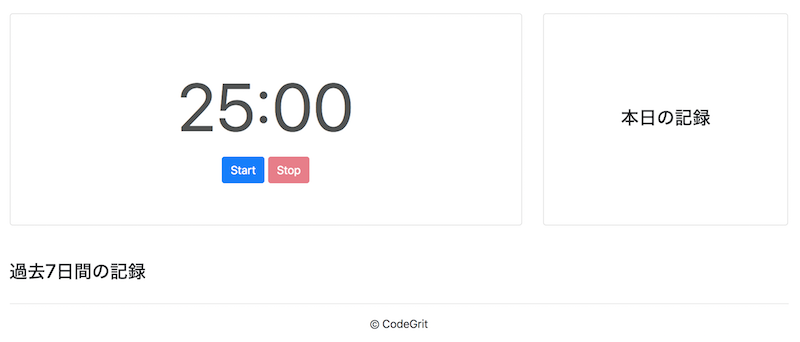

## STEP2: 初期状態のタイマーの表示を行う

### 2-1: カウントダウンを表示する要素を取得する

さて、Appクラスの初期パラメータが設定出来たので、タイマーの初期値がサイト上でも表示されるようにしていきましょう。

index.htmlを見ていただくと、`<div id="time-display" class="time-display"></div>`という部分が見つかるかと思います。タイマーの時間はこの要素の中に表示します。

この要素をまずは取得しましょう。

```javascript
...省略
class App {
  constructor() {
    ...省略
    this.timeDisplay = document.getElementById('time-display');
  }
}
...省略
```

### 2-2: カウントダウンの初期値表示のテストを書く

さて、次に初期値表示のためのテストを書いていきます。

まずはindex.jsに`export default App`を追加して、Appクラスをモジュール化します。

```javascript
...省略
class App {省略}

export default App;
```

testフォルダ内のindex.test.jsファイルにテストを書いていきましょう。カウントダウンの初期表示は"25:00"ですので、これをテストで表します。

index.test.js
```javascript
import App from '../src/index';
import template from './template'; // テスト内でhtmlファイルのbody部分を読み込む。

describe('displayTime', () => {
  test('初期化時に25:00を表示する。', () => {
    document.body.innerHTML = template;
    const app = new App();
    const timeDisplay = document.getElementById('time-display');
    expect(app.isTimerStopped).toBeTruthy(); // 初期状態でタイマーは止まっています
    expect(timeDisplay.innerHTML).toEqual('25:00'); // 25:00が表示されていることを確認します。
  });
});
```

上記では、templateファイルからHTMLのコードを読み込んで、bodyタグ内に読み込んだコードを適用しています。その後、読み込んだコードから`id="time-display"`となっている要素を読み込み、この要素無いに初期値である"25:00"が表示されるかどうかをテストしています。

テストコードを動かしてみましょう。まだ、コードを書いていないので以下のようにテスト失敗の結果が出ます。

```bash
$ npm run test
...
Tests:       1 failed, 1 total
```

### 2-3. displayTimeファンクションを実装する

さて、次にこのテストが通るようにdisplayTimeファンクションを書いていきます。

```javascript
...省略

class App {
  constructor() {
    ...省略

    this.displayTime(); // 初期化時にdisplayTimeを呼び出す。
  }

  displayTime() {
    // 残りの分数と秒数を与えるための変数
    let mins;
    let secs;
    // タイマーがストップしている時は、常に作業時間の長さを表示。
    if (this.isTimerStopped) {
      mins = this.workLength;
      secs = 0;
    }
    // 数値を文字に変換
    const minsString = mins.toString();
    let secsString = secs.toString();
    // 秒数が一桁のときは0を加えて2桁表示にする。
    if (secs < 10) {
      secsString = `0${secsString}`;
    }
    // 最後に分数と秒数を表示
    this.timeDisplay.innerHTML = `${minsString}:${secsString}`;
  }
}
```

現状は、タイマーが動き出した後の表示は実装しておらず、タイマーが止まっているときに"25:00"が表示されるようにのみしています。テスト結果を再度見てみましょう。無事にテストが通っていることが確認出来たでしょうか。

実際の画面も開いてみてみましょう。以下の画像のように"25:00"が表示されているはずです。

