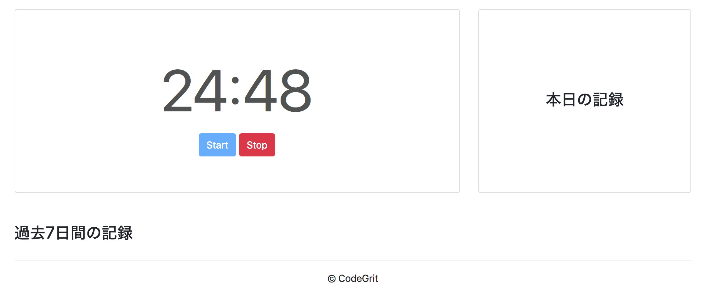

## STEP4: updateTimerファンクションを実装する

さて、ここまででupdateTimerが定期的に呼び出されるようになりました。updateTimerの役割は以下の2つです。

1. タイマーの残り時間が0以下の場合、作業中のときは休憩時間に、休憩中のときは作業時間に状態を切り替える。(つまりonWorkの状態を変更する)
2. displayTimeを呼び出して、時間表示を更新する。

### 4-1: updateTimer内でdisplayTimeを呼び出す。

まずは2のみを実装していきましょう。ここでstartTimerと同様にupdateTimerとdisplayTimeの2つのファンクションがtimeという引数を取り、初期値に現在時刻が入るように変更しましょう。これでテストが自由な時間で出来るようになります。

```javascript
class App {
  constructor() {
    ...省略
    this.startTimer = this.startTimer.bind(this);
    this.updateTimer = this.updateTimer.bind(this);
    this.displayTime = this.displayTime.bind(this);
    ...省略
  }
  ...省略
  updateTimer(time = moment()) {
    this.displayTime(time);
  }

  displayTime(time = moment()) {
    // 残りの分数と秒数を与えるための変数
    let mins;
    let secs;
    // タイマーがストップしている時は、常に作業時間の長さを表示。
    if (this.isTimerStopped) {
      mins = this.workLength;
      secs = 0;
    }
    // 数値を文字に変換
    const minsString = mins.toString();
    let secsString = secs.toString();
    // 秒数が一桁のときは0を加えて2桁表示にする。
    if (secs < 10) {
      secsString = `0${secsString}`;
    }
    // 最後に分数と秒数を表示
    this.timeDisplay.innerHTML = `${minsString}:${secsString}`;
  }
}
```

### 4-2: displayTimeをアップデートしてカウントダウンの表示を行う

さて、displayTime関数なのですが、現状は初期状態の表示しか実装しておらず、カウントダウンに合わせた表示が出来ません。そこで、カウントダウン中の表示がうまく行われるようにテストを書いていきます。

```javascript
describe('displayTime', () => {
  ...省略
  test('カウントダウン中の時間を適切に表示する。', () => {
    document.body.innerHTML = template;
    const app = new App();
    const now = moment();
    const startOfToday = now.startOf('day');
    // タイマースタート後の状態を作り出す。
    app.startButton.disabled = true;
    app.stopButton.disabled = false;
    app.isTimerStopped = false;
    app.startAt = startOfToday;
    app.endAt = moment(startOfToday).add(25, 'minutes');
    // タイマースタートしてから51秒後の時間でテストを行う。
    app.displayTime(moment(startOfToday).add(51, 'seconds'));
    const timeDisplay = document.getElementById('time-display');
    expect(timeDisplay.innerHTML).toEqual('24:09'); // 51秒経過しているので残り時間は24:09
  });
});
```

再度、テスト結果を見てみましょう。`TypeError: Cannot read property 'toString' of undefined`というエラーが表示されているかと思います。これは、タイマーが動いている時にdisplayTime内のminsとsecsの2つの変数がundefinedのままのため生じています。

displayTimeをアップデートして、エラーの解決をしテストが通るようにしましょう。

```javascript
...省略

const SECOND = 1000; // 1000ミリ秒
const MINUTE = 60 * SECOND; // 1分のミリ秒数
const DAY = 24 * 60 * MINUTE; // 1日のミリ秒数

class App {
  ...省略
  displayTime(time = moment()) {
    let mins;
    let secs;
    if (this.isTimerStopped) {
      mins = this.workLength.toString();
      secs = 0;
    } else {
      const diff = this.endAt.diff(time); // 与えられた時間(通常現在時刻)と、終了時刻との差を取得。差はミリ秒で得られる。
      mins = Math.floor(diff / MINUTE); // 分数を得て、少数点以下の切り捨てを行う
      secs = Math.floor((diff % MINUTE) / 1000); // 秒数を得て、少数点以下の切り捨てを行う
    }
    const minsString = mins.toString();
    let secsString = secs.toString();
    if (secs < 10) {
      secsString = `0${secsString}`;
    }
    this.timeDisplay.innerHTML = `${minsString}:${secsString}`;
  } 
}
```

上記のようにして、終了時刻と現在時刻との差をミリ秒単位で取得後、分と秒を取得しています。再度テストを確認してみましょう。無事にテストが通っているはずです。

実際の画面でも見てましょう。ちゃんと動いていることが確認出来るでしょうか? しかし、何度か試してみると、24:59と24:58との間が非常に短いことに気づくかと思います。これはなぜかというと最初のdisplayTimeの呼び出しが500ミリ秒経過した時点で、起こっているため、24:59と24:58との間が500ミリ秒以下しかないためです。そこでstartTimerファンクション実行時にdisplayTimeが呼び出されるようにします。

```javascript
startTimer(e = null, time = moment()) {
    ...省略
    this.displayTime();
  }
```

再度、確認することで違和感なくタイマーが動くようになったはずです。



### 4-3: カウントダウンが0秒になったときの切り替えを実装する

さて次に、作業時間が0秒になった時と休憩時間が0秒になったときの切り替えを実装します。まずはテストを書きましょう。

```javascript
describe('updateTimer', () => {
  test('作業時間が終わったら休憩時間に切り替える。', () => {
    document.body.innerHTML = template;
    const app = new App();
    const now = moment();
    const startOfToday = now.startOf('day');
    // 作業中の状態を作り出す。
    app.startButton.disabled = true;
    app.stopButton.disabled = false;
    app.isTimerStopped = false;
    app.startAt = startOfToday;
    app.endAt = moment(startOfToday).add(25, 'minutes');
    // 終了時刻から100ミリ秒後の時間でテストを行う。
    app.updateTimer(moment(startOfToday).add(25, 'minutes').add(100, 'millisecond'));
    const timeDisplay = document.getElementById('time-display');
    expect(timeDisplay.innerHTML).toEqual('5:00');
    expect(app.onWork).not.toBeTruthy(); // 休憩時間に切り替わっている。
  });
  test('休憩時間が終わったら作業時間に切り替える。', () => {
    document.body.innerHTML = template;
    const app = new App();
    const now = moment();
    const startOfToday = now.startOf('day');
    // 休憩中の状態を作り出す。
    app.onWork = false;
    app.startButton.disabled = true;
    app.stopButton.disabled = false;
    app.isTimerStopped = false;
    app.startAt = startOfToday;
    app.endAt = moment(startOfToday).add(5, 'minutes');
    // 終了時刻から100ミリ秒後の時間でテストを行う。
    app.updateTimer(moment(startOfToday).add(5, 'minutes').add(100, 'millisecond'));
    const timeDisplay = document.getElementById('time-display');
    expect(timeDisplay.innerHTML).toEqual('25:00'); 
    expect(app.onWork).toBeTruthy(); // 作用時間に切り替わっている。
  });
});
```

テストが通らないことを確認したら、このテストが通るようにupdateTimerを実装していきます。

```javascript
updateTimer(time = moment()) {
  const rest = this.endAt.diff(time); // 残り時間を取得
  if (rest <= 0) { // 残り時間が0以下の場合に切り替えを行う。
    this.onWork = !this.onWork;
    this.startAt = time;
    this.endAt = this.onWork ? moment(time).add(this.workLength, 'minutes')
      : moment(time).add(this.breakLength, 'minutes');
  }
  this.displayTime(time);
}
```

これで、無事にテストが通ることが確認出来たはずです。
